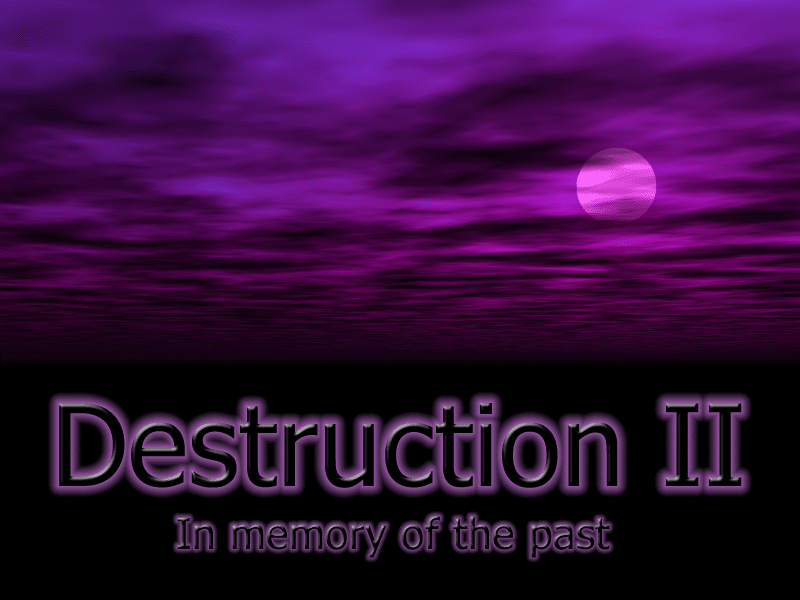
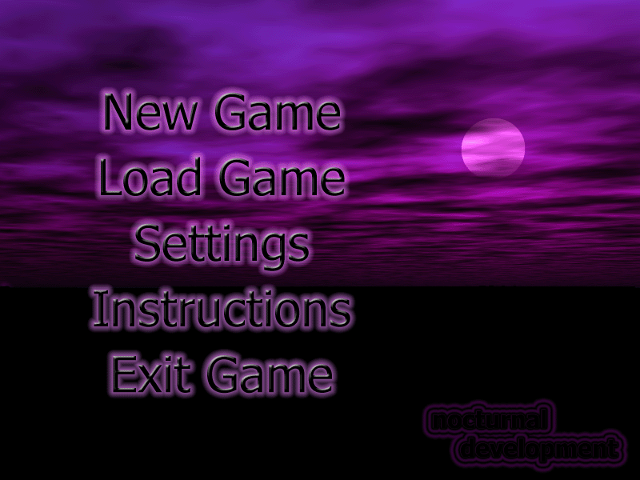
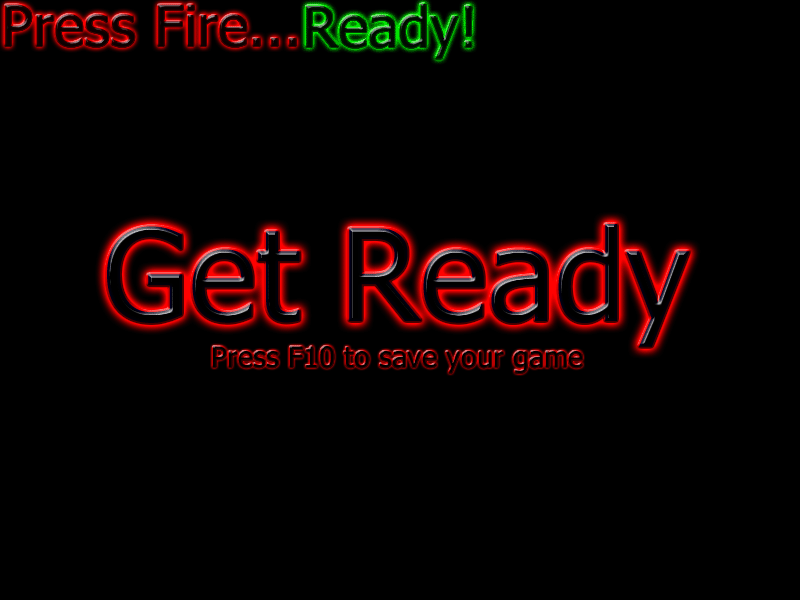

# 💔 Destruction II HD: Resurrection Project

<div align="center">




### *"Some games live in our hearts forever..."*

**[🇷🇺 Русская версия](README_RU.md)** | **[📖 Documentation](PROGRESS.md)** | **[🤝 Contributing](CONTRIBUTING.md)**

[](https://boosty.to/destruction2hd)

</div>

---

## 🎮 Game Screenshots

<div align="center">
<table>
  <tr>
    <td></td>
    <td></td>
  </tr>
  <tr>
    <td align="center"><b>Main Menu</b></td>
    <td align="center"><b>Battle Preparation</b></td>
  </tr>
</table>
</div>

---

## 📖 A Personal Story

My cousin and I absolutely loved this game when we were 10-15 years old. We spent endless hours battling each other, laughing at failed shots, and celebrating epic victories. Destruction II wasn't just a game for us — it was our tradition, our way of being together.

Even as we grew up, every time we met, we'd fire up this old game, returning to those carefree times. The pixelated tanks, destructible terrain, simple graphics — it was all part of our friendship.

**But life is unpredictable. My cousin is no longer with us...**

I can't bring him back to life, but I can bring our game and our memories back to life. Every line of code in this project is a tribute to those happy moments we shared together.

## 🎮 About Destruction II

**Destruction II** is a legendary turn-based tactical tank and artillery game created by Johan Torp (Nocturnal Development) in 2001-2003. Released as freeware, it captured the hearts of thousands of players worldwide.

### 🎯 Game Features:
- **Turn-based tactical combat** with destructible terrain
- **45+ weapons** including tanks, missiles, grenades, and energy weapons
- **Multiple unit types**: Players, Tanks, Droids, Machines, Cars
- **Local multiplayer** for epic battles with friends
- **Physics-based projectiles** with realistic trajectories
- **Destructible environment** - every explosion changes the battlefield

### 💡 Why This Resurrection Project?
- 🕹️ **Nostalgia** — For many of us, this game is part of our childhood
- 💻 **Inaccessibility** — The original doesn't work on Windows 10/11
- 🎯 **Preserving Legacy** — Classic games shouldn't disappear
- ❤️ **Memory** — This is more than just code, these are memories

## 🤝 Who's Behind This Project?

I'm not a programmer. Not a game developer. Not an engineer.

**I'm just a person with memories and a dream.**

I've been using computers since I was 6 years old, but I've never written code professionally. This entire project is being created with the help of artificial intelligence:

- 🤖 **Claude 4.5 Sonnet** (Opus 4.1, Haiku 4.5) — my main assistant
- 💬 I just describe in plain language what needs to be done
- 🧠 AI transforms my words into working code
- ⚡ We work together when I have free time

**I'm not a "prompt engineer". I'm just someone who knows how to set tasks properly and has a dream.**

## 🚀 Development Roadmap

### 📊 Current Progress: **85%** ⬛⬛⬛⬛⬛⬛⬛⬛⬜⬜

**Last Updated**: October 24, 2025
**Status**: 🟢 BREAKTHROUGH! SDL rendering works! 🎉

📋 **Detailed progress tracking**: See [PROGRESS.md](PROGRESS.md)

### ✅ Completed:
- ✅ **GAME LAUNCHES!** SDL rendering successfully works!
- ✅ Full transition from DirectX 7 to SDL2
- ✅ Updated from C++98 to C++20 (all 327 files compile!)
- ✅ vcpkg package manager + CMake build system
- ✅ Git repository on GitHub: https://github.com/elchin92/destruction_II_hd
- ✅ SDL2_DirectDrawCompat and SDL2_DirectInputCompat compatibility layers
- ✅ All game bitmaps load and convert successfully
- ✅ Game loop runs, Flip() is called every frame

### 🔄 In Progress:
- 🔄 Fixing black backbuffer (game graphics not rendering yet)
- 🔄 Solving dual window issue (Win32 and SDL)
- ⏳ Porting sound to SDL2_mixer

### 📅 Phase 1: Resurrection (Current)
- ✅ Porting to Windows 10/11 x64
- 🔄 Replacing DirectX 7 with SDL2
- 🔄 Updating from C++98 to C++20
- ⏳ First working build

### 🎨 Phase 2: HD Remaster
- 📐 High resolution support (4K)
- 🎮 Improved controls
- 🎵 Remastered audio
- 💎 Steam release

### 📱 Phase 3: Mobile Era
- 📱 iOS version
- 🤖 Android version
- 🌐 Online multiplayer
- 🏆 Global leaderboards

### 🌟 Phase 4: Destruction III
If everything works out... If the community supports us...
Maybe we'll create a completely new game — **Destruction III**.
With your help. With your ideas. With your support.

## 💝 How You Can Help

I need help from people who understand:
- **This is a project of love**, not commerce
- **This is a tribute**, not just a port
- **This is a community**, not a solo project

### Help Needed:
- 🐛 **Testing** — Find bugs, help fix them
- 💻 **Code** — Improve, optimize, modernize
- 🎨 **Graphics** — HD textures, new sprites
- 🎵 **Sound** — Remaster sound effects
- 🌍 **Translation** — Localize to other languages
- 📢 **Promotion** — Tell your friends
- ⭐ **Support** — Just star this repository

## 🚀 Quick Start

### Option 1: Download Release (Coming Soon!)
```
📦 Download the latest release from GitHub Releases
📂 Extract to any folder
🎮 Run DestructionII_HD.exe
🎯 Enjoy the game!
```

### Option 2: Build from Source

#### Prerequisites
- Windows 10/11 (64-bit)
- Visual Studio 2022 (Community Edition is free)
- Git
- CMake (comes with Visual Studio)

#### Build Instructions

```bash
# 1. Clone the repository
git clone https://github.com/elchin92/destruction_II_hd.git
cd destruction_II_hd

# 2. Install vcpkg (package manager)
git clone https://github.com/microsoft/vcpkg.git
cd vcpkg
.\bootstrap-vcpkg.bat
.\vcpkg integrate install
cd ..

# 3. Install dependencies
.\vcpkg\vcpkg install sdl2:x64-windows sdl2-image:x64-windows sdl2-mixer:x64-windows

# 4. Configure the project
mkdir build
cd build
cmake .. -DCMAKE_TOOLCHAIN_FILE="[path to vcpkg]/scripts/buildsystems/vcpkg.cmake"

# 5. Build
cmake --build . --config Debug

# 6. Run the game!
cd Debug
.\DestructionII.exe
```

## 🛠️ Technical Details

### Original Game (2003)
| Component | Technology |
|-----------|------------|
| Graphics | DirectX 7 (DirectDraw) |
| Input | DirectInput |
| Audio | DirectSound |
| Language | C++98 |
| Compiler | Visual C++ 6.0 |
| Platform | Windows 98/XP (32-bit) |

### HD Resurrection (2025)
| Component | Technology |
|-----------|------------|
| Graphics | SDL2 (cross-platform) |
| Input | SDL2 Input System |
| Audio | SDL2_mixer |
| Language | C++20 |
| Compiler | Visual Studio 2022 |
| Platform | Windows 10/11 (64-bit) |
| Build System | CMake + vcpkg |

## 📜 Version History

- **v0.1** (in development) - Initial port to modern systems
- **v1.0** (2003) - Original version by Johan Torp

## ❤️ Acknowledgments

- **Johan Torp / Nocturnal Development** — For creating this masterpiece
- **Claude AI (Anthropic)** — For turning my words into code
- **My Cousin** — For all those happy moments. Rest in peace.
- **Everyone Who Supports** — You make this possible

## 📬 Contact

If you want to help or just share your memories of the game:
- 🐙 GitHub Issues — For bugs and suggestions
- ⭐ Star — If this project touched your heart
- 🔄 Fork — If you want to contribute

---

<div align="center">

### *"This game is a bridge between past and future, between memory and dream"*

**Made with love and memories**

</div>

---

## 🏗️ Current Development Status

### ✅ Completed
- ✅ **GAME RUNS!** Window opens, SDL rendering functional
- ✅ CMake build system for x64, C++20
- ✅ vcpkg dependency management
- ✅ Full codebase compiles (327 files, 0 errors!)
- ✅ SDL2 DirectDraw compatibility layer (90% complete)
- ✅ SDL2 DirectInput compatibility layer (basic functionality)
- ✅ Fixed uninitialized pointer crashes
- ✅ Fixed bitmap path issues
- ✅ Emotional README in Russian and English
- ✅ GitHub repository: https://github.com/elchin92/destruction_II_hd

### 🔄 In Progress
- 🔄 Fixing black backbuffer (test graphics work, game graphics don't)
- 🔄 Solving dual window problem
- 🔄 DirectSound → SDL2_mixer migration

### ⏳ Next Steps
- Debug why BltFast() doesn't render game graphics
- Remove test graphics and fix actual game rendering
- Port sound system to SDL2_mixer
- Create installer for Windows 10/11

---

## 📝 License

Original game: Copyright © 2001-2003 Johan Torp / Nocturnal Development

This modernization project is created to preserve gaming heritage and is distributed with respect to the original creators.

---

<div align="center">


### ⭐ If this project touched your heart, please star it! ⭐

### 📢 Share with friends who loved this game!

</div>

---

## 🎯 Call to Action

This project needs YOU! Whether you're a developer, designer, tester, or just a fan of the game - your contribution matters!

### 👉 How to Start:
1. ⭐ **Star this repository** - It helps others find the project
2. 🔄 **Fork and contribute** - Every improvement counts
3. 🐛 **Report bugs** - Help us make it perfect
4. 💬 **Share your memories** - Tell us your Destruction II stories
5. 📢 **Spread the word** - Share with gaming communities

### 🏆 Hall of Fame
Contributors will be added here and credited in the game!

---

## 📞 Connect & Support

- **GitHub Issues**: [Report bugs or suggest features](https://github.com/elchin92/destruction_II_hd/issues)
- **Discussions**: [Join the community](https://github.com/elchin92/destruction_II_hd/discussions)
- **Support Development**: [Boosty](https://boosty.to/destruction2hd)

---

<div align="center">

### *Together we can bring Destruction II back to life!*

**Made with 💔 and memories by someone who just misses playing with his cousin**

</div>

